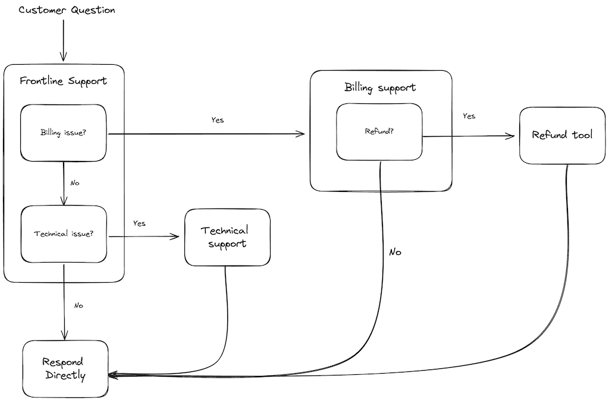

# SimulacraJS

A TypeScript framework for simulating conversations with conversational agents in Jest. This framework define simulation agents that speak with your conversational agents with a rich assertion API for you to test expected agent behavior.

Here's an example testing a customer support scenario:

```typescript
simulationTest(
  'should handle refund requests appropriately',
  {
    conversationGenerator: new LLMConversationGenerator({
      role: 'frustrated customer who recently purchased a faulty laptop',
      task: 'You bought a laptop last week that keeps crashing. You have tried troubleshooting with tech support but nothing works. Now you want to request a refund.',
      model: 'gpt-4' // optional, defaults to gpt-4
    }),
    getAgentResponse: (simulatedUserState) => {
      // Your agent logic here
      return handleCustomerRequest(simulatedUserState.lastResponse?.content);
    },
  },
  async ({ agent }) => {
    // Test that refund handler was called
    simulationExpect(agent.events, async () => {
      expect(mockHandleRefund).toHaveBeenCalled();
    }).eventually();
  }
);
```

## Features

- Simulate conversations with deterministic or LLM-powered responses
- Rich assertion API for testing agent behavior.
- Automated reporting of simulation results. 
- Extends the full power of [Jest's test framework](https://jestjs.io/).

## Roadmap
- [ ] Support for test parallelization
- [ ] Support for (cheaper) simulation agent models
- [ ] LLM-as-judge transcript conversation transcript evaluation
- [ ] Support "streamed input", which waits for an "stop" token before generating an agent response
- [ ] Anything else! We're open to suggestions!

## Set up

1. Install the framework using `npm install simulacra-js`
2. Define your test using `simulationTest` in a file with a `agent.test.ts` extension
3. Add OPENAI_API_KEY to your environment variables (if using LLM-powered responses)
4. Run your new agent tests using `npx jest agent.test.ts`.

Look at the [examples](./examples) for an example of a project setup to use the framework.

## Usage

The framework provides two main ways to generate conversations:

1. `DeterministicConversationGenerator` for deterministic tests with predefined user messages
2. `LLMConversationGenerator` for testing with real language models


You can use `DeterministicConversationGenerator` to test a conversational agent with a specific sequence of user messages:

```typescript
simulationTest(
  'should handle a specific conversation flow',
  {
    conversationGenerator: new DeterministicConversationGenerator([
      "I understand you're having issues with a printer jam. Have you tried removing all paper and checking for debris?",
      "Let's try resetting the printer. Please turn it off, wait 30 seconds, then turn it back on.",
      "Great! The printer should now be working correctly. Is there anything else you need help with?"
    ]),
    getAgentResponse: (simulatedUserState) => handleTechSupport(simulatedUserState.lastResponse?.content)
  },
  async ({ agent }) => {
    simulationExpect(agent.events, async () => {
      expect(mockPrinterReset).toHaveBeenCalled();
    }).eventually();
  }
);
```

### Assertions

The framework provides powerful assertion capabilities through `simulationExpect`:

- `eventually()`: Asserts a condition is true by the end of the simulation

```typescript
// Assert something happens by the end of a simulation
simulationExpect(simulatedUser.events, async (simulatedUser) => {
  expect(simulatedUser.lastReceivedMessage?.content).toMatchSnapshot();
}).eventually();
```

- `always()`: Asserts a condition remains true throughout the entire simulation

```typescript
// Assert something remains true throughout a simulation
simulationExpect(simulatedUser.events, async (simulatedUser) => {
  expect(mockDeleteUserData.notToBeCalled()).toBe(true);
}).always();
```

- `when(condition)`: Asserts a condition when a specific state is met

```typescript
// Assert something when a condition is met during a simulation
simulationExpect(simulatedUser.events, async (simulatedUser) => {
  expect(mockDeleteUserData).toBeCalled();
}).when(state => state.lastSimulatedUserResponse?.content === 'Please delete my data.');
```

### Reporting

Simulacra displays errors within the context of the conversation between the simulation agent and your agent, providing clear and detailed test output:

```
Test Failures:

In /Users/kennethacquah/simulacra/javascript/__tests___/e2e/tests/fakeTests/expectEventually.test.ts:
✗ expectEventually should fail when condition never becomes true failing test
  13. [assistant] Message for turn 7
  14. [user] Is there anything else you need?
  15. [assistant] Message for turn 8
  16. [user] Thank you for your patience.
  17. [assistant] Message for turn 9
  18. [user] Have a great day!
  (12 earlier steps not shown)

  expect(received).toBe(expected) // Object.is equality

Expected: true
Received: false
  Stack trace:
    
    Expected: true
    Received: false
    at SimulationExpectation.assertionFn (/Users/kennethacquah/simulacra/javascript/__tests___/e2e/tests/fakeTests/expectEventually.test.ts:47:37)
    at AgentEventEmitter.checkCondition (/Users/kennethacquah/simulacra/javascript/assertions/expect.ts:31:24)

Test Summary:
Total Tests: 1
Passed: 0
Failed: 1
```

The output includes:
- File path of the failing test
- Test name with fail status (✗)
- Detailed error message and stack trace for failures, in context of conversation with your agent.
- Summary of total tests, passes, and failures

# Examples

To show how simulacra can be used, the [examples](./examples) directory. The first of which tests a simple customer support scenario chatbot, [specified in LangGraph's tutorial series](https://langchain-ai.github.io/langgraphjs/tutorials/chatbots/customer_support_small_model/).



The expected behavior of this agent is simple.

> Depending on this entry node's response, the edge from that node will use an LLM call to determine whether to respond directly to the user or invoke either the billing_support or technical_support nodes.

> The technical support will attempt to answer the user's question with a more focused prompt.
> The billing agent can choose to answer the user's question, or can call out to a human for approval for a refund using a dynamic breakpoint.

From this, there might be a few things we'd like to test:

1. If the user requests technical support, the agent should begin to be able to provide it.
2. If the user requests billing support, the agent should provide the agent with a refund.

With the following tests, we can ensure that our customer support bot moves through the correct nodes when speaking to a simulated user.

```typescript
  simulationTest(
    "should call handleRefund when processing refund request",
    {
      conversationGenerator: new LLMConversationGenerator({
        model: "gpt-4o",
        role: "frustrated customer who recently purchased a faulty laptop",
        task: `You bought a laptop last week that keeps crashing.
                You have tried troubleshooting with tech support but nothing works.
                Now you want to request a refund for your purchase. Express your frustration politely but firmly.`,
      }),
      getAgentResponse,
    },
    async ({ agent }) => {
      simulationExpect(agent.events, async () => {
        expect(mockHandleRefund).toHaveBeenCalled();
      }).eventually();
    }
  );

  simulationTest(
    "should not call handleRefund when processing non-refund request",
    {
      getAgentResponse,
      conversationGenerator: new LLMConversationGenerator({
        model: "gpt-4o",
        role: "customer who recently purchased a new phone",
        task: "You have an old laptop with a fan that's making a loud whirring noise. You need technical support to figure out how to quiet it down or turn it off safely.",
      }),
    },
    async ({ agent }) => {
      simulationExpect(agent.events, async () => {
        expect(mockHandleTechnicalSupport).toHaveBeenCalled();
      }).eventually();
      simulationExpect(agent.events, async () => {
        expect(mockHandleRefund).not.toHaveBeenCalled();
      }).always();
    }
  );
```

This is an error you might see if for "" if a user does not appropriately handle the refund request.

```ansi
✗ Customer Support Model Tests should call handleRefund when processing refund request
  13. [assistant] I'll transfer you to the billing team right away. Please hold for just a moment. 

(Brief pause)

You're now being transferred to the billing team. They'll be able to assist you with your billing concerns. Thank you for holding.
  14. [user] Thank you, I appreciate your help in getting this resolved. I'll wait for the billing team to assist me.
  15. [assistant] I'm going to transfer you to the billing team right away. Please hold for just a moment while I connect you.
  16. [user] Thank you, I appreciate your help in getting this resolved. I'll wait for the billing team to assist me.
  17. [assistant] I'm going to transfer you to the billing team right away. Please hold for just a moment. I'll have someone assist you shortly.
  18. [user] Thank you, I appreciate your help in getting this resolved. I'll wait for the billing team to assist me.
  (12 earlier steps not shown)

  expect(jest.fn()).toHaveBeenCalled()

Expected number of calls: >= 1
Received number of calls:    0
  Stack trace:
    
    Expected number of calls: >= 1
    Received number of calls:    0
    at SimulationExpectation.assertionFn (/Users/kennethacquah/simulacra/examples/javascript/customer-support/__tests__/customer_support_small_model.test.ts:92:34)
    at AgentEventEmitter.checkCondition (/Users/kennethacquah/simulacra/examples/javascript/customer-support/node_modules/.pnpm/simulacra-js@1.0.7_@types+node@20.17.16_jest@29.7.0_@types+node@20.17.16_ts-node@10.9.2_@type_ozmgkwfp3d43ean3nckcsopkve/node_modules/simulacra-js/assertions/expect.ts:31:24)
    at processTicksAndRejections (node:internal/process/task_queues:95:5)

Test Summary:
Total Tests: 2
Passed: 1
Failed: 1

```


## License

MIT
